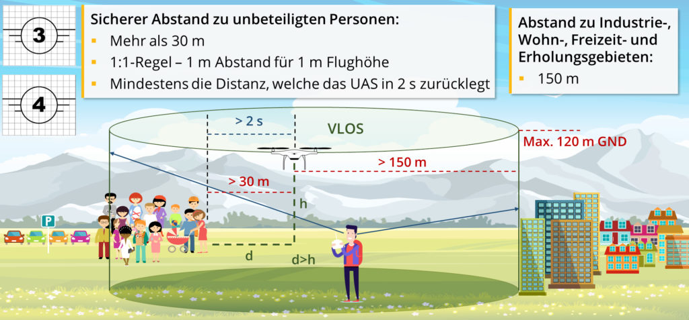

# Gesetze zum Fliegen

Der **[EU Befähigungsnachweis A1 / A3](https://lba-openuav.de/einstieg/)** (25€) ist unbedingt erforderlich, um unsere Drohnen zu fliegen. Das Fernpiloten-Zeugnis ist rechtlich nicht nötig.

Außerdem muss eine Haftpflichtversicherung abgeschlossen sein, in welcher durch das unbemannte Luftfahrzeug verursachte Schäden für mindestens 750 000 Rechnungseinheiten abgedeckt sind. Ist der UAS-Betreiber (e-ID auf der Drohne) und Fernpilot nicht dieselbe Person, muss speziell geprüft werden, ob der Versicherungsschutz besteht. Viele Privathaftpflichtversicherungen decken nur Drohnen bis 250 g.

!!! info "THD Versicherung"
    Wir sind über die THD Versichert. Ansprechpartner: [ivian.kuscheff@th-deg.de](ivian.kuscheff@th-deg.de) 

Da die Drohnen mehr als 900 g wiegen, finden die Flüge in der **[Unterkategorie A3](https://lba-openuav.de/onlinekurs/lehrmaterial/luftrecht-und-sicherheit/uas-klassifizierungen/)** statt, so wie in der **UAS** (Unmanned Aircraft System) **[Klasse C4](https://lba-openuav.de/onlinekurs/lehrmaterial/luftrecht-und-sicherheit/uas-klassifizierungen/)**, da es sich um einen Eigenbau handelt, dem wichtige Sicherheitsmerkmale fehlen.

- Der Mindestabstand zu Industrie-, Wohn-, Erholungs- und Freizeitgebieten sowie zu Menschenansammlungen muss stets 150 m betragen.
- Es muss sichergestellt sein, dass im gesamten Betriebsbereich keine unbeteiligten Personen zu erwarten sind. Es muss ein Sicherheitsabstand von mehr als 30 m, keinesfalls weniger als die 1:1-Regel (1 m Abstand für 1 m Höhe) und mindestens die vom UAS in 2 Sekunden zurückgelegte Strecke, zu unbeteiligten Einzelpersonen gewährleistet sein.
- Die maximale Höhe über dem Boden beträgt 120 m.
- Es sind nur Flüge mit Sichtverbindung (VLOS) erlaubt.

# UAS-Betreibernummer (e-ID)
Auf jeder Drohne muss eine UAS-Betreibernummer (e-ID) angebracht sein, welche man durch die Registrierung bei der zuständigen Behörde erhält. 20€ für eine natürliche Person 50€ für eine Juristische Person. Wenn bereits eine UAS-Betreiberregistrierung einer juristischen Person vorhanden ist oder eine andere natürliche Person als UAS-Betreiber auftrit, dessen e-ID am UAS angebracht ist, übernimmt der aktuelle Pilot nur die Funktion des Fernpiloten und nicht des UAS-Betreibers. Eine erneute Registrierung ist nicht nötig.

!!! danger "e-ID Drohne"
    Auf der VTOL 3 Drohne (Brett) ist keine e-ID, sondern eine persönliche Identifikationsnummer eines EU-Kompetenznachweises für Fernpiloten angebracht (vermutlich von sven.schmid@elektra-uas.de)! Die e-ID hat ivian.kuscheff@th-deg.de. Diese sollte irgendwann auch auf der Drohne angebracht werden.

# Flugrestriktionen

Informationen zu Flugrestriktionen können über die [Digitale Plattform Unbemannte Luftfahrt](https://maptool-dpul-prod.dfs.de) oder über die [Droniq App](https://droniq.de/pages/droniq-app) abgefragt werden. Die [ICAO Karten](https://secais.dfs.de/pilotservice/service/aup/aup_edit_map.jsp#contentMap) könne über den [DFS](https://secais.dfs.de/pilotservice/service/aup/aup_edit_map.jsp#contentMap) abgerufen werden.

# Anträge & Behördendienste
Sämtliche Anträge und Behördendienste können bei der [DIPUL (Digitale Plattform Unbemannte Luftfahrt)](https://www.dipul.de/homepage/de/antraege-behoerdendienste/) gefunden werden.
